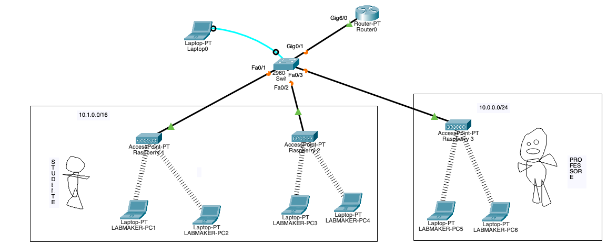

# Packet Tracer

Prima di tutto cominciamo a simulare la rete con Packet Tracer.

## Layout logico
Configuriamo 3 access point (AP) e per ogni access point colleghiamo 2 laptop.

Gli AP hanno solo la funzione di _bridge_, dispositivo di livello ISO/OSI 1, ovvero convertiranno solo il traffico tra WiFi ed Ethernet (cavo in rame), senza fare altre operazioni. 

Gli AP sono collegati ad uno switch (nel nostro caso uno switch 2960), che dovrà essere configurato opportunamente per dividere il traffico nelle VLAN docenti e studenti.

Infine aggiungiamo un server che fornirà il servizio DHCP, in modo differenziato per le due VLAN.

Le connessioni Ethernet devono essere come segue:

|Porta| Device|
|-----| -----|
|FastEthernet 0/1|Raspberry 1 (access point 1)|
|FastEthernet 0/2|Raspberry 2 (access point 2)|
|FastEthernet 0/3|Raspberry 3 (access point 3)|
|FastEthernet 0/4|Server DHCP|
|Seriale RS-232|Laptop di configurazione|

Nell'immagine è anche visibile il laptop collegato con il cavo console che servirà per la configurazione, simulando in modo più realistico quello che avviene in pratica.

## Layout fisico
Sistemiamo anche la parte fisica. Andiamo sul layout fisico (bottoni in alto a sinistra in PT), quindi entriamo dentro Intercity, Home City e configuriamo il Corporate Office.

Creiamo 3 Generic Container ed usando il tasto "Navigator" (il primo nella barra, con la bussola), spostiamo i 3 AP, uno in ogni container. Spostiamo anche i laptop in modo da essere vicino all'AP.

Entriamo anche dentro il Main Wiring Closet per vedere come è sistemato. Dovremmo già trovare il laptop sul tavolo collegato allo switch.

